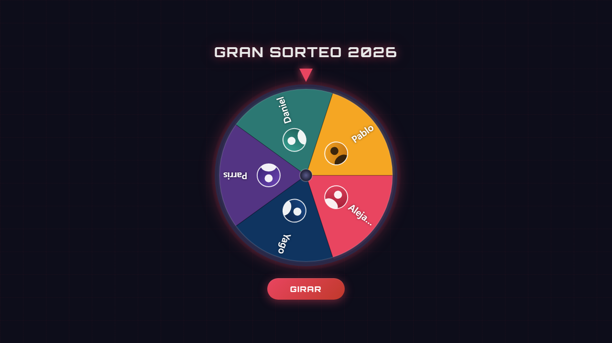

# 🎡 Ruleta de Sorteo

Web app local para sorteos con ruleta animada. Sin servidor, sin dependencias de build. Abre `index.html` y listo.



## Características

- Ruleta canvas con animación física: aceleración → velocidad máxima → parada suave
- Foto/avatar por participante (circular, clipped)
- Confetti y modal de ganador al parar
- Tick sonoro generado por Web Audio API (sin archivos)
- Configuración completa via `config.js`
- Tests E2E con Playwright

## Uso

```bash
# Abrir directamente (Firefox / Chrome con --allow-file-access)
start index.html

# O con servidor local
npx serve . -p 3000
```

## Configuración

Edita `config.js` y recarga el navegador:

```js
window.RAFFLE_CONFIG = {
  title: "Mi Sorteo",
  spinDuration: 6000,       // milisegundos (3000–12000)
  sound: true,

  participants: [
    { name: "Ana" },
    { name: "Carlos", color: "#FF0000" },          // color forzado
    { name: "María",  image: "fotos/maria.jpg" },  // foto local (necesita servidor)
    { name: "Pedro",  image: "data:image/jpeg;base64,..." }, // foto embebida (funciona en file://)
  ],

  colors: ["#E94560", "#0F3460", "#533483", ...]   // paleta ciclada
};
```

### Fotos en file://

Chrome bloquea canvas + imágenes de `file://`. Dos opciones:

1. **Embeber como base64** en `config.js` (funciona siempre):
   - Convierte tu foto en [base64encode.org](https://www.base64encode.org/) o similar
   - Pega el resultado como `"data:image/jpeg;base64,..."`

2. **Usar servidor local**:
   ```bash
   npx serve . -p 3000
   # Abrir http://localhost:3000
   ```

## Tests

```bash
npm install
npx playwright install chromium

npm test              # todos los tests
npx playwright test tests/demo.spec.js   # graba vídeo demo en test-results/
```

## Estructura

```
ruleta-sorteo/
├── index.html          # entrada
├── config.js           # configuración del sorteo (editar aquí)
├── css/styles.css
├── js/
│   ├── wheel.js        # canvas + rendering
│   ├── animation.js    # física del giro (easing coseno C¹)
│   ├── winner.js       # confetti + modal ganador
│   └── main.js         # orquestación
├── fotos/              # fotos de participantes (para uso con servidor)
└── tests/
    ├── wheel.spec.js   # suite E2E
    └── demo.spec.js    # graba vídeo demo
```
